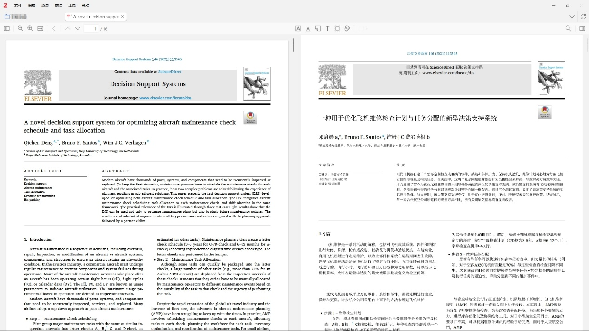
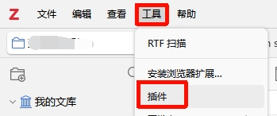
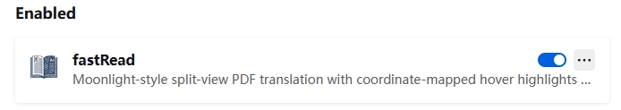
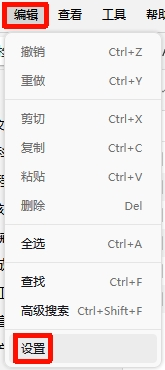
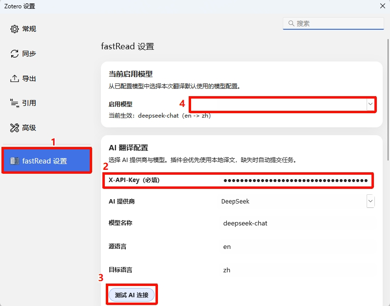
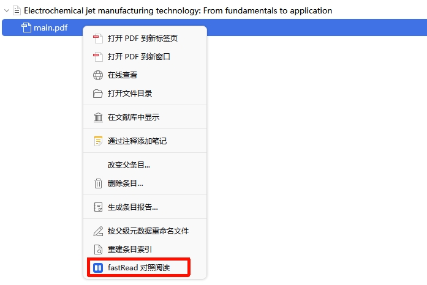
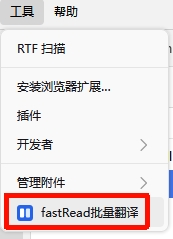
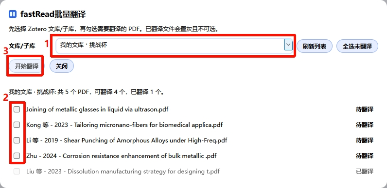

Zotero的fastRead对照翻译插件

# 简介：

本插件是基于Babel-Doc开发的，核心特点是能够在zotero 7.0.32及以下版本实现英文文献保留原排版的翻译，并且与原文对照显示（左边原文右边译文）。效果如下：

# 使用方法：

1. 在release中下载fastRead-Python.xpi文件（只需下载这一个文件即可）
2. 打开zotero的【工具】-【插件】，然后导入xpi文件（加载有点慢请耐心等待）

3. 在zotero的【编辑】-【设置】-【fastRead设置】配置API key（默认为deepseek），然后点击测试连接，等待结果，如果为绿色则表示模型以接通，可以选择启用。

4. 单文件翻译
右键要翻译的文件，选择【fastRead对照翻译】，等待结果即可。

5. 批量翻译
点击【工具】-【fastRead批量翻译】，选择要翻译的文件所在的文库，勾选要翻译的PDF（已翻译的为灰色无法选择），最后点击开始翻译然后等待结果即可。

查看方式：右键要阅读的PDF选择【fastRead对照翻译】即可查看

# 不足之处

1. 由于各种原因，现在文献翻译速率较慢，需要耐心等待（平均5min左右翻译一篇）。建议使用者在第一天晚上开始翻译，第二天即可全部翻译完成。对于急于看文献的使用者不建议使用本插件。
2. 插件由作者 vibe coding 完成，所以作者未发现的问题恳请使用者反馈。
3. 作者目前大模型只测试了 deepseek 和 qwen，使用者接入其他模型的时候有错误可以及时向作者反馈。
谢谢大家！

# 开源协议

本项目采用 **GNU Affero General Public License v3.0** 开源。

- SPDX: `AGPL-3.0-only`
- 许可证全文见：`LICENSE`
